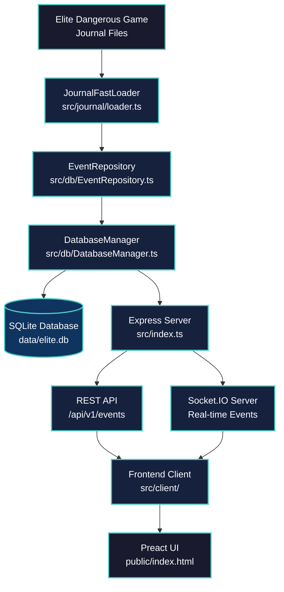
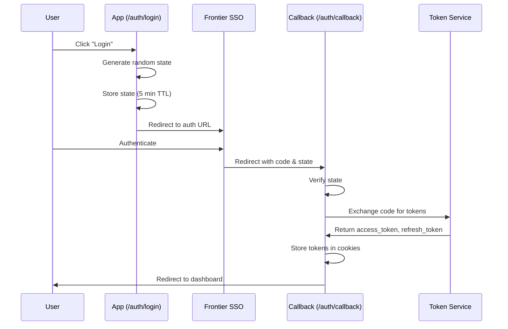
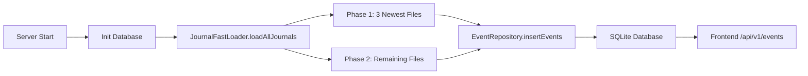
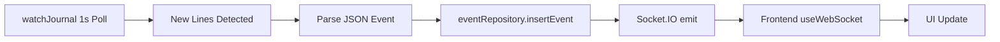
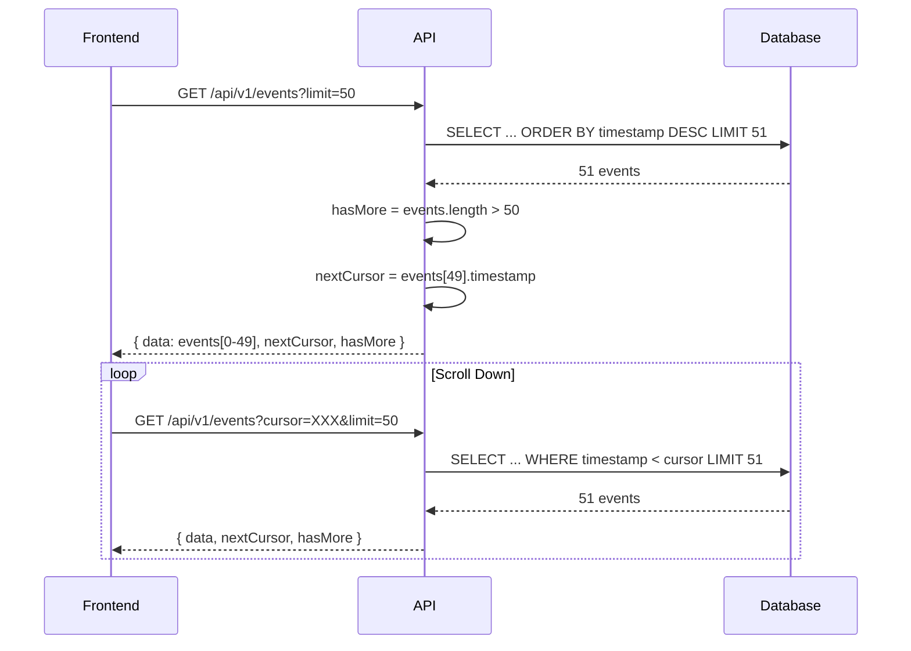

# Architecture Overview - ELITE-DANGEROUS-NEXT

> **Version:** 1.0.0-beta  
> **Last Updated:** 2026-03-01  
> **Track:** EDN-010 Project Study & Architecture Documentation

---

## Table of Contents

1. [Overview](#1-overview)
2. [High-Level Architecture](#2-high-level-architecture)
3. [Technology Stack](#3-technology-stack)
4. [Core Components](#4-core-components)
5. [Data Flow](#5-data-flow)
6. [Event Types & Categories](#6-event-types--categories)
7. [API Reference](#7-api-reference)
8. [Testing Strategy](#8-testing-strategy)
9. [Configuration](#9-configuration)
10. [Performance](#10-performance)
11. [Security](#11-security)

---

## 1. Overview

**ELITE-DANGEROUS-NEXT** — это веб-приложение для мониторинга, анализа и визуализации событий из журналов игры Elite Dangerous в реальном времени.

### Key Features

- 📖 **Автоматическое чтение журналов** — Streaming parser с прогрессивной загрузкой
- 💾 **SQLite хранение** — better-sqlite3 с WAL mode для производительности
- 🌐 **Веб-интерфейс** — Preact с HUD-дизайном в стиле Elite Dangerous
- ⚡ **Real-time обновления** — Socket.IO для мгновенных уведомлений
- 📊 **Статистика и аналитика** — Агрегация данных в реальном времени

---

## 2. High-Level Architecture



### Architecture Diagram Description

1. **Game Journal Files** → Elite Dangerous создаёт JSON-события в реальном времени
2. **JournalFastLoader** → Streaming parser читает файлы без полной загрузки в память
3. **EventRepository** → CRUD операции с пакетной вставкой (500 событий/транзакция)
4. **DatabaseManager** → Singleton менеджер better-sqlite3 с WAL mode
5. **SQLite Database** → Постоянное хранение на диске
6. **Express Server** → REST API endpoints
7. **Socket.IO** → Real-time push событий клиентам
8. **Frontend Client** → Preact hooks для polling и WebSocket
9. **Preact UI** → HUD-интерфейс с infinite scroll

---

## 3. Technology Stack

### Backend

| Component | Technology | Version | Purpose |
|-----------|------------|---------|---------|
| Runtime | Node.js | >= 20.0.0 | JavaScript runtime |
| Framework | Express | ^4.18.2 | HTTP server & routing |
| Database | better-sqlite3 | ^12.6.2 | Native SQLite |
| Real-time | Socket.IO | ^4.7.2 | WebSocket server |
| WebSocket | ws | ^8.19.0 | Raw WebSocket |
| Logger | winston | ^3.19.0 | File rotation logging |

### Frontend

| Component | Technology | Version | Purpose |
|-----------|------------|---------|---------|
| UI Library | Preact | ^10.28.3 | Lightweight React alternative |
| Compatibility | React | ^18.3.1 | Compatibility layer |
| Build Tool | Vite | ^7.3.1 | Fast bundler |
| Virtualization | @tanstack/react-virtual | ^3.13.18 | List virtualization |

### Development

| Component | Technology | Version | Purpose |
|-----------|------------|---------|---------|
| Language | TypeScript | ^5.3.3 | Type safety |
| Runtime | tsx | ^4.21.0 | TypeScript execution |
| Testing | Jest | Latest | Unit testing |
| Types | @types/node | ^20.10.4 | Node.js types |

---

## 4. Core Components

### 4.1 Database Layer

#### DatabaseManager.ts

**File:** `src/db/DatabaseManager.ts`

**Responsibilities:**
- Singleton менеджер SQLite подключения
- Инициализация с WAL mode
- Автоматические миграции схемы
- Transaction support

**Key Methods:**

```typescript
class DatabaseManager {
  init(): void                    // Инициализация БД
  getDatabase(): Database         // Получить подключение
  close(): void                   // Закрытие с WAL checkpoint
  exec(sql: string): void         // Выполнить SQL
  prepare(sql: string): Statement // Подготовить statement
  transaction<T>(fn: () => T): T  // Выполнить транзакцию
}
```

**WAL Mode Pragmas:**
```sql
PRAGMA journal_mode = WAL;           -- Write-Ahead Logging
PRAGMA synchronous = NORMAL;         -- Баланс скорость/надёжность
PRAGMA cache_size = -64000;          -- 64MB cache
PRAGMA temp_store = memory;          -- Временные таблицы в RAM
PRAGMA busy_timeout = 5000;          -- 5s timeout на блокировки
```

#### EventRepository.ts

**File:** `src/db/EventRepository.ts`

**Responsibilities:**
- CRUD операции для событий
- Cursor-based пагинация
- Детерминированная генерация event_id
- Статистика событий

**Key Methods:**

```typescript
class EventRepository {
  insertEvent(data: ParsedEventData): string | null
  insertEvents(dataList: ParsedEventData[]): number
  getEvents(limit: number, offset: number): PaginatedEvents
  getEventsByCursor(cursor: string, limit: number): CursorPaginationResult
  getStats(): EventStats
  count(): number
  getLatestEvent(eventType?: string): EliteEvent | null
}
```

**Event ID Generation:**
```typescript
// Детерминированный ID: одинаковая строка журнала → одинаковый ID
generateEventId(data: ParsedEventData): string {
  const timestamp = data.timestamp;
  const event = data.event;
  const uniqueKey = data.system_name || data.body || '';
  return `${timestamp}_${event}_${uniqueKey}`;
}
```

**Schema:**
```sql
CREATE TABLE events (
  id INTEGER PRIMARY KEY AUTOINCREMENT,
  event_id TEXT UNIQUE NOT NULL,
  timestamp TEXT NOT NULL,
  event_type TEXT NOT NULL,
  commander TEXT,
  system_name TEXT,
  station_name TEXT,
  body TEXT,
  raw_json TEXT NOT NULL,
  created_at TEXT DEFAULT (datetime('now'))
);

-- Indexes
CREATE INDEX idx_events_timestamp ON events(timestamp DESC);
CREATE INDEX idx_events_type ON events(event_type);
CREATE INDEX idx_events_event_id ON events(event_id) UNIQUE;
CREATE INDEX idx_events_type_timestamp ON events(event_type, timestamp DESC);
CREATE INDEX idx_events_system ON events(system_name, timestamp DESC);
```

---

### 4.2 Journal Parser

#### loader.ts

**File:** `src/journal/loader.ts`

**JournalFastLoader Class:**

```typescript
class JournalFastLoader {
  constructor(journalPath: string)
  
  loadAllJournals(
    progressCallback?: ProgressCallback,
    priorityFiles: number = 3,
    loadAll: boolean = true
  ): Promise<number>
  
  quickLoad(progressCallback?: ProgressCallback): Promise<number>
  fullLoad(progressCallback?: ProgressCallback): Promise<number>
}
```

**Key Features:**

1. **Streaming** — `fs.createReadStream` + `readline` (без полной загрузки файла)
2. **Parallel Processing** — максимум 5 файлов одновременно
3. **Batch Insert** — 500 событий на транзакцию
4. **Incremental Load** — пропуск обработанных файлов (по размеру и mtime)
5. **Priority Loading** — сначала новые файлы (fast bootstrap)

**Performance Target:** < 5 секунд для любого количества файлов

**Flow:**
```
1. Get journal files sorted by date (newest first)
2. Phase 1: Load 3 newest files (priority)
3. Phase 2: Load remaining files (background)
4. For each file:
   - Stream lines with readline
   - Parse JSON events
   - Batch insert every 500 events
   - Track processed files for incremental load
```

---

### 4.3 REST API

#### events.ts

**File:** `src/api/events.ts`

**Endpoints:**

| Method | Endpoint | Description |
|--------|----------|-------------|
| GET | `/api/v1/events/history` | Пагинированная история с фильтрацией |
| GET | `/api/v1/events/:id` | Детали события по ID |
| GET | `/api/v1/events/:id/related` | Связанные события (before/after) |
| GET | `/api/v1/events/types` | Все типы событий с counts |
| GET | `/api/v1/events/search` | Поиск по полям |

**Validation:**

```typescript
function validatePaginationParams(req: Request): { limit: number; offset: number } {
  const limit = Math.min(
    Math.max(parseInt(req.query.limit as string) ?? 50, 1),
    1000
  );
  const offset = Math.max(parseInt(req.query.offset as string) ?? 0, 0);
  return { limit, offset };
}
```

**Response Format:**

```typescript
interface ApiResponse<T> {
  success: boolean;
  data: T;
  error?: string;
  pagination?: {
    total: number;
    limit: number;
    offset: number;
    hasMore: boolean;
  };
}
```

---

### 4.4 Authentication (OAuth2)

#### auth.ts & token-service.ts

**Files:**
- `src/routes/auth.ts` — Express routes
- `src/services/token-service.ts` — OAuth2 логика

**OAuth2 Flow:**



**Endpoints:**

| Method | Endpoint | Description |
|--------|----------|-------------|
| GET | `/auth/login` | Initiate OAuth2 flow |
| GET | `/auth/callback` | OAuth2 callback handler |
| GET | `/auth/logout` | Logout and clear tokens |
| GET | `/auth/status` | Get current auth status |
| POST | `/auth/refresh` | Refresh access token |

**Security:**
- CSRF protection через state parameter
- HttpOnly cookies (secure в production)
- State expiration: 5 минут
- Token refresh с automatic retry

---

### 4.5 Frontend (Preact)

#### App.tsx & Hooks

**Files:**
- `src/client/App.tsx` — главный компонент
- `src/client/hooks/*.ts` — React hooks

**Hooks:**

| Hook | Purpose |
|------|---------|
| `useEvents` | Cursor-based pagination + polling (3s) |
| `useWebSocket` | Socket.IO подключение с auto-reconnect |
| `useAuth` | Authentication state management |
| `useStats` | Statistics fetching |
| `useProgressLoader` | Progress tracking для загрузки журналов |

**API Client:**

```typescript
// src/client/api/client.ts
const apiClient = {
  getEvents(cursor?: string, limit?: number): Promise<EventsResponse>
  searchEvents(query: string, limit?: number, offset?: number): Promise<EventsResponse>
  getStats(): Promise<StatsResponse>
}
```

**WebSocket Events:**

```typescript
socket.on('journal:event', (data) => {
  // Новое событие из журнала
})

socket.on('stats:update', (data) => {
  // Обновление статистики
})
```

---

### 4.6 Main Server

#### index.ts

**File:** `src/index.ts`

**Middleware Order (CRITICAL):**

```
1. Parsers (express.json(), cookieParser)
2. CORS
3. API Routes (/health, /auth, /api/v1/*)
4. Socket.IO attachment
5. Static files (express.static('public'))
6. SPA fallback (regex: ^(?!\/api\/|\/auth\/|\/socket\.io\/).*$)
7. 404 handler (JSON для API)
```

**Key Functions:**

```typescript
async function main(): Promise<void>
async function findFreePort(startPort: number): Promise<number>
function getJournalPath(): string
function watchJournal(journalPath: string, onEvent: fn): () => void
function calculateStats(): EventStats
async function shutdown(signal: string): Promise<void>
```

**Graceful Shutdown Sequence:**

1. Stop journal watcher
2. Close database (WAL checkpoint)
3. Close Socket.IO
4. Close HTTP server
5. Close logger
6. Exit with code 0

---

## 5. Data Flow

### 5.1 Initial Load



**Steps:**

1. Server starts
2. Database initialized (better-sqlite3)
3. JournalFastLoader.loadAllJournals()
   - Phase 1: Load 3 newest files (fast bootstrap)
   - Phase 2: Load remaining files
4. Events inserted via EventRepository.insertEvents()
5. Frontend loads via /api/v1/events

---

### 5.2 Real-time Updates



**Steps:**

1. watchJournal() polls latest journal file (1s interval)
2. New lines detected
3. Parse JSON event
4. eventRepository.insertEvent()
5. Socket.IO emit('journal:event', data)
6. Frontend useWebSocket receives event
7. UI updates with new event

---

### 5.3 Cursor-based Pagination



---

## 6. Event Types & Categories

### 6.1 Event Categories

| Category | Count | Examples |
|----------|-------|----------|
| **combat** | ~15 | Bounty, FactionKillBond, Died, Interdicted |
| **trade** | ~15 | MarketBuy, MarketSell, Cargo, MiningRefined |
| **exploration** | ~10 | Scan, FSSDiscoveryScan, CodexEntry |
| **travel** | ~15 | Location, FSDJump, Docked, SupercruiseEntry |
| **engineering** | ~5 | Synthesise, EngineerCraft, Blueprint |
| **social** | ~10 | Friends, WingInvite, ReceiveText |
| **missions** | ~7 | MissionAccepted, MissionCompleted, MissionFailed |
| **odyssey** | ~10 | Embark, Disembark, SuitLoadout, UseConsumable |
| **fleet** | ~15 | CarrierJump, ShipyardBuy, ModuleRetrieve |
| **system** | ~10 | Rank, Progress, Statistics, LoadGame |

### 6.2 Event Catalog

**File:** `src/data/events-catalog.ts`

**Structure:**

```typescript
interface EventDefinition {
  label: string;      // Отображаемое имя (RU)
  labelEn: string;    // Отображаемое имя (EN)
  category: string;   // Категория
  icon: string;       // Иконка
  description: string;      // Описание (RU)
  descriptionEn: string;    // Описание (EN)
}

const EVENTS_CATALOG: Record<string, EventDefinition> = {
  "FSDJump": {
    label: "Прыжок FSD",
    labelEn: "FSD Jump",
    category: "travel",
    icon: "🚀",
    description: "Прыжок через гиперпространство",
    descriptionEn: "Hyperspace jump via FSD"
  },
  // ... 100+ events
}
```

---

## 7. API Reference

### Base URL

```
Development: http://localhost:3000
```

### Events API

#### GET /api/v1/events/history

Get paginated event history with optional filters.

**Query Parameters:**

| Parameter | Type | Default | Description |
|-----------|------|---------|-------------|
| `limit` | number | 50 | Max events (1-1000) |
| `offset` | number | 0 | Offset |
| `eventType` | string | - | Filter by event type |
| `startDate` | ISO date | - | Filter from date |
| `endDate` | ISO date | - | Filter to date |

**Response:**

```json
{
  "success": true,
  "data": [...],
  "pagination": {
    "total": 58276,
    "limit": 50,
    "offset": 0,
    "hasMore": true
  }
}
```

#### GET /api/v1/events/:id

Get event details by ID.

**Response:**

```json
{
  "success": true,
  "data": {
    "event_id": "2024-01-01T12:00:00Z_FSDJump_Sol",
    "timestamp": "2024-01-01T12:00:00Z",
    "event_type": "FSDJump",
    "commander": "CMDR",
    "system_name": "Sol",
    "raw_json": "{\"event\":\"FSDJump\",...}"
  }
}
```

#### GET /api/v1/events/:id/related

Get related events (before/after) for context.

**Query Parameters:**

| Parameter | Type | Default | Description |
|-----------|------|---------|-------------|
| `limit` | number | 10 | Events before/after (1-100) |

**Response:**

```json
{
  "success": true,
  "data": {
    "before": [...],
    "after": [...]
  }
}
```

#### GET /api/v1/events/search

Search events by keywords.

**Query Parameters:**

| Parameter | Type | Default | Description |
|-----------|------|---------|-------------|
| `query` | string | - | Search query (required) |
| `limit` | number | 50 | Max results |
| `offset` | number | 0 | Offset |

**Search Fields:** event_type, system_name, station_name, body, commander, raw_json

---

## 8. Testing Strategy

### 8.1 Test Structure

```
src/__tests__/
├── unit/           # Unit tests (in-memory DB)
│   ├── DatabaseManager.test.ts
│   └── EventRepository.test.ts
├── integration/    # Integration tests
│   └── api.test.ts
├── api/            # API endpoint tests
│   └── events.test.ts
├── journal/        # Journal parser tests
│   └── loader.test.ts
├── services/       # Service tests
│   └── token-service.test.ts
└── middleware/     # Middleware tests
    └── auth.test.ts
```

### 8.2 Test Configuration

**File:** `jest.config.mjs`

```javascript
export default {
  preset: 'ts-jest/presets/default-esm',
  testEnvironment: 'node',
  collectCoverageFrom: ['src/**/*.ts'],
  coverageThreshold: {
    global: {
      statements: 20,
      branches: 15,
      functions: 25,
      lines: 20
    }
  }
}
```

### 8.3 Test Isolation

```typescript
// In-memory SQLite для тестов
process.env.TEST_DB_PATH = ':memory:'

// Очистка между тестами
dbManager.resetForTestingWithCleanup()
```

---

## 9. Configuration

### 9.1 Environment Variables

```env
# Server
PORT=3000
NODE_ENV=development

# Database
DATABASE_PATH=data/elite.db

# Journal
JOURNAL_PATH=%USERPROFILE%\Saved Games\Frontier Developments\Elite Dangerous

# Logging
LOG_LEVEL=debug

# OAuth2 (Frontier)
FRONTIER_CLIENT_ID=xxx
FRONTIER_CLIENT_SECRET=xxx
FRONTIER_REDIRECT_URI=http://localhost:3000/auth/callback
```

### 9.2 Config File

**File:** `src/utils/config.ts`

```typescript
interface Config {
  port: number;
  nodeEnv: 'development' | 'production';
  journalPath: string;
  logLevel: LogLevel;
}

function getConfig(): Config
function logConfig(): void
```

---

## 10. Performance

### 10.1 Database

| Optimization | Value | Impact |
|--------------|-------|--------|
| WAL mode | `journal_mode = WAL` | Concurrent reads/writes |
| Cache size | `cache_size = -64000` | 64MB cache |
| Indexes | 5 indexes | Fast queries |
| Batch insert | 500 events/tx | Reduced I/O |

### 10.2 Journal Loading

| Optimization | Value | Impact |
|--------------|-------|--------|
| Streaming | fs.createReadStream | No full file load |
| Parallel | max 5 files | Faster loading |
| Incremental | Skip processed | Skip unchanged files |
| Priority | 3 newest first | Fast bootstrap |

**Target:** < 5 секунд для любого количества файлов

### 10.3 API

| Optimization | Description |
|--------------|-------------|
| Cursor pagination | Efficient for large datasets |
| Prepared statements | SQL injection protection + speed |
| Connection pooling | Single SQLite connection |

---

## 11. Security

### 11.1 OAuth2

| Measure | Implementation |
|---------|----------------|
| CSRF protection | Random state parameter |
| Token storage | HttpOnly cookies |
| Secure cookies | Production only |
| State expiration | 5 minutes TTL |

### 11.2 API

| Measure | Implementation |
|---------|----------------|
| Input validation | Query params validation |
| SQL injection | Prepared statements |
| Rate limiting | express-rate-limit (planned) |

---

## References

- [README.md](./README.md)
- [structure.md](./structure.md)
- [Product Definition](../../conductor/product.md)
- [Tech Stack](../../conductor/tech-stack.md)
- [Workflow](../../conductor/workflow.md)
