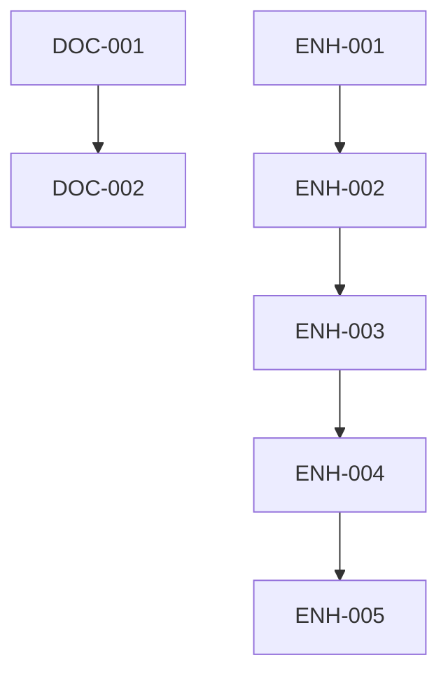

# Tasks: Clean Release Build (FR-7)

> **Feature ID:** FR-7  
> **Created:** 2 марта 2026 г.  
> **Status:** ⏳ Ready for Implementation  
> **Branch:** `v1.0.1-pre`

---

## 📋 Overview

This document decomposes **Phase 2 (Documentation)** and **Phase 3 (Enhancements)** from the technical plan into atomic, executable tasks.

### Task Summary

| Phase | Tasks | Priority | Status |
|-------|-------|----------|--------|
| **Phase 2** | Documentation | P2-P3 | ⏳ Pending |
| **Phase 3** | Enhancements | P1-P3 | ⏳ Future |

---

## 🎯 Phase 2: Documentation Tasks

### Task DOC-001: Update CONTRIBUTING.md

**ID:** `DOC-001`
**Title:** Add Clean Release section to CONTRIBUTING.md
**Priority:** P2 (High)
**Estimated Effort:** 30 minutes
**Status:** ✅ Complete (2026-03-02)

**Description:**
Add a new section to `CONTRIBUTING.md` documenting the Clean Release build process and requirements for contributors.

**Files to Create/Modify:**
- `CONTRIBUTING.md` (modify)

**Dependencies:**
- None

**Acceptance Criteria:**
- [x] Section "Clean Release Build" added to CONTRIBUTING.md
- [x] Explains what folders are excluded (`.specify/`, `conductor/`, `specs/`)
- [x] Documents how to run validation (`npm run validate:clean`)
- [x] Explains why this is important (security, cleanliness)
- [x] Includes troubleshooting tips

**Progress Notes:**
- [2026-03-02] Started implementation
- [2026-03-02] Completed section with 177 lines added
- [2026-03-02] Validation passed (`npm run validate:clean`)
- [2026-03-02] Committed: 8865ae7

**Implementation Details:**
- Added comprehensive section with:
  - What is Clean Release
  - Why This Matters (4 bullet points)
  - Excluded Folders table (10 folders)
  - Validation instructions with expected output
  - Automatic Validation explanation
  - Troubleshooting (5 common issues)
  - Maintainer guidelines
- Updated table of contents
- Commit: 8865ae7

**Content Outline:**
```markdown
## Clean Release Build

### What is Clean Release?

Our build process automatically excludes development metadata from published packages.

### Excluded Folders

- `.specify/` - Spec-Driven Development specifications
- `conductor/` - Project tracking and plans
- `specs/` - Feature specifications
- `scripts/` - Build scripts

### Validation

Before publishing, run:
```bash
npm run validate:clean
```

### Why This Matters

- Security: Internal docs don't leak to public packages
- Cleanliness: Users get only necessary files
- Predictability: Consistent build output
```

**Implementation Notes:**
- Keep section concise (300-500 words)
- Use existing project tone and style
- Link to `.npmignore` for full list

---

### Task DOC-002: Add README Section

**ID:** `DOC-002`  
**Title:** Add Clean Release badge and section to README.md  
**Priority:** P3 (Medium)  
**Estimated Effort:** 20 minutes

**Description:**
Add a brief mention of Clean Release build to the main README, including a badge showing validation status.

**Files to Create/Modify:**
- `README.md` (modify)

**Dependencies:**
- None

**Acceptance Criteria:**
- [x] Badge added showing clean build status
- [x] Brief section in Features mentioning Clean Release
- [x] Link to CONTRIBUTING.md for details

**Progress Notes:**
- [2026-03-02] Started implementation
- [2026-03-02] Added badge to README.md header
- [2026-03-02] Added Clean Release Build subsection (5 bullet points)
- [2026-03-02] Committed: aca84f1

**Implementation Details:**
- Badge added: `[](CONTRIBUTING.md#clean-release-build)`
- Section added with 5 benefits:
  - 🛡️ Automatic exclusion of dev metadata
  - ✅ Pre-publish validation
  - 📦 Clean, predictable distributions
  - 🔒 Security (no internal docs leak)
  - 📖 Link to CONTRIBUTING.md
- 8 lines added to README.md
- Commit: aca84f1

**Content to Add:**

**Badge** (after existing badges):
```markdown
[](CONTRIBUTING.md#clean-release-build)
```

**Section** (in Features list):
```markdown
### 🧹 Clean Release Build
- Automatic exclusion of development metadata
- Pre-publish validation hook
- Secure, predictable distributions
```

**Implementation Notes:**
- Badge is static (not dynamic CI/CD) for now
- Keep section brief (2-3 bullet points)

---

### Task DOC-003: Create .github/ISSUE_TEMPLATE for Build Issues

**ID:** `DOC-003`  
**Title:** Create issue template for build/validation problems  
**Priority:** P3 (Low)  
**Estimated Effort:** 15 minutes

**Description:**
Create a GitHub issue template for users to report build or validation issues.

**Files to Create:**
- `.github/ISSUE_TEMPLATE/build-issue.md`

**Dependencies:**
- None

**Acceptance Criteria:**
- [ ] Template includes fields for:
  - Node.js version
  - npm version
  - Error message
  - Steps to reproduce
- [ ] Template suggests running `npm run validate:clean` first
- [ ] Clear labeling (type: build)

**Template Content:**
```markdown
---
name: 🛠️ Build/Validation Issue
about: Report a problem with build or validation
title: '[BUILD] '
labels: 'type: build'
---

**Describe the issue**
A clear description of what's happening.

**Environment**
- Node.js version: [e.g. 20.11.0]
- npm version: [e.g. 10.2.4]
- OS: [e.g. Windows 11]

**Error Output**
```
[Paste error here]
```

**Steps to Reproduce**
1. Run `npm run validate:clean`
2. See error

**Expected Behavior**
What should happen?

**Troubleshooting Tried**
- [ ] Ran `npm install`
- [ ] Checked Node.js version (>= 20)
- [ ] Reviewed CONTRIBUTING.md

**Additional Context**
Any other details.
```

---

## 🚀 Phase 3: Enhancement Tasks

### Task ENH-001: CI/CD GitHub Actions Workflow

**ID:** `ENH-001`  
**Title:** Create GitHub Actions workflow for validation  
**Priority:** P1 (Critical)  
**Estimated Effort:** 1 hour

**Description:**
Create a GitHub Actions workflow that runs clean build validation on every push and PR.

**Files to Create:**
- `.github/workflows/validate-clean.yml`

**Dependencies:**
- None (can be implemented independently)

**Acceptance Criteria:**
- [ ] Workflow runs on `push` to `v1.0.1-pre` and `main`
- [ ] Workflow runs on `pull_request` to `v1.0.1-pre` and `main`
- [ ] Job installs dependencies (`npm install`)
- [ ] Job runs `npm run validate:clean`
- [ ] Workflow fails if validation fails
- [ ] Workflow name: "Clean Build Validation"

**Workflow Content:**
```yaml
name: Clean Build Validation

on:
  push:
    branches: [ 'v1.0.1-pre', 'main' ]
  pull_request:
    branches: [ 'v1.0.1-pre', 'main' ]

jobs:
  validate-clean:
    runs-on: ubuntu-latest
    
    steps:
    - uses: actions/checkout@v4
    
    - name: Setup Node.js
      uses: actions/setup-node@v4
      with:
        node-version: '20'
        cache: 'npm'
    
    - name: Install dependencies
      run: npm ci
    
    - name: Run clean build validation
      run: npm run validate:clean
```

**Implementation Notes:**
- Use `npm ci` for faster, cleaner installs
- Cache npm dependencies for speed
- Ubuntu runner is sufficient (cross-platform script)

---

### Task ENH-002: Extended Validation - File Patterns

**ID:** `ENH-002`  
**Title:** Add pattern-based validation for forbidden files  
**Priority:** P2 (High)  
**Estimated Effort:** 45 minutes

**Description:**
Extend validation script to check for forbidden file patterns (not just folders).

**Files to Modify:**
- `scripts/validate-clean-build.mjs` (modify)
- `.npmignore` (modify, optional)

**Dependencies:**
- None

**Acceptance Criteria:**
- [ ] Script checks for `*.log` files in dist/
- [ ] Script checks for `.env` files in dist/
- [ ] Script checks for `*.test.ts` files in dist/
- [ ] Script reports each violation separately
- [ ] All checks must pass for validation to succeed

**Implementation Approach:**

Add to `validate-clean-build.mjs`:
```javascript
// Forbidden file patterns to check in dist/
const FORBIDDEN_PATTERNS = [
  { pattern: '*.log', description: 'Log files' },
  { pattern: '.env', description: 'Environment files' },
  { pattern: '*.test.ts', description: 'Test files' },
  { pattern: '*.spec.ts', description: 'Specification files' },
  { pattern: 'coverage/', description: 'Coverage reports' },
];

// Add function to check patterns
function checkForbiddenPatterns(distPath) {
  const issues = [];
  for (const { pattern, description } of FORBIDDEN_PATTERNS) {
    // Use glob or simple file scanning
    // Report any matches
  }
  return issues;
}
```

**Testing:**
- Create test files in dist/ and verify detection
- Remove test files after validation

---

### Task ENH-003: Performance Optimization - Parallel Checks

**ID:** `ENH-003`  
**Title:** Optimize validation script with parallel checks  
**Priority:** P3 (Low)  
**Estimated Effort:** 30 minutes

**Description:**
Improve validation script performance by running checks in parallel.

**Files to Modify:**
- `scripts/validate-clean-build.mjs` (modify)

**Dependencies:**
- ENH-002 (recommended but not required)

**Acceptance Criteria:**
- [ ] Validation completes in < 1 second (currently < 2 sec)
- [ ] All checks run concurrently where possible
- [ ] Error reporting remains clear and ordered
- [ ] Code remains maintainable

**Implementation Approach:**

Use `Promise.all()` for independent checks:
```javascript
async function runAllChecks() {
  const checks = [
    checkNpmIgnoreExists(),
    checkNpmIgnoreEntries(),
    checkDistCleanliness(),
  ];
  
  const results = await Promise.allSettled(checks);
  
  // Aggregate and report results
  return results.every(r => r.status === 'fulfilled' && r.value === true);
}
```

**Performance Targets:**
- Current: ~1.5-2 seconds
- Target: < 1 second
- Stretch: < 0.5 seconds

---

### Task ENH-004: Add --fix Flag for Auto-Correction

**ID:** `ENH-004`  
**Title:** Implement --fix flag for automatic cleanup  
**Priority:** P3 (Low)  
**Estimated Effort:** 1 hour

**Description:**
Add a `--fix` flag to automatically remove forbidden files/folders from dist/.

**Files to Modify:**
- `scripts/validate-clean-build.mjs` (modify)
- `package.json` (modify, add `validate:clean:fix` script)

**Dependencies:**
- None

**Acceptance Criteria:**
- [ ] `--fix` flag triggers interactive confirmation
- [ ] User sees list of files to be deleted
- [ ] User confirms before deletion
- [ ] Files are removed safely
- [ ] Validation re-runs after fix
- [ ] Dry-run mode (`--fix --dry-run`) shows what would be deleted

**Implementation Approach:**

Add CLI argument parsing:
```javascript
const args = process.argv.slice(2);
const fixMode = args.includes('--fix');
const dryRun = args.includes('--dry-run');

if (fixMode) {
  const issues = await findIssues(distPath);
  if (issues.length > 0) {
    console.log('Found issues to fix:');
    issues.forEach(issue => console.log(`  - ${issue.path}`));
    
    if (!dryRun) {
      const confirm = await askUser('Proceed with cleanup? (y/n)');
      if (confirm === 'y') {
        await fixIssues(issues);
      }
    }
  }
}
```

**Safety Considerations:**
- Never delete without confirmation (unless `--force`)
- Always show what will be deleted
- Log all deletions for audit trail

---

### Task ENH-005: Add JSON Output Format

**ID:** `ENH-005`  
**Title:** Add --json flag for machine-readable output  
**Priority:** P3 (Low)  
**Estimated Effort:** 20 minutes

**Description:**
Add a `--json` flag to output validation results in JSON format for CI/CD integration.

**Files to Modify:**
- `scripts/validate-clean-build.mjs` (modify)

**Dependencies:**
- None

**Acceptance Criteria:**
- [ ] `--json` flag outputs results as JSON
- [ ] JSON includes: pass/fail, timestamp, issues array
- [ ] Exit codes remain consistent (0=pass, 1=fail)
- [ ] Human-readable output remains default

**Output Format:**
```json
{
  "success": true,
  "timestamp": "2026-03-02T12:00:00.000Z",
  "checks": [
    { "name": "npmignore-exists", "passed": true },
    { "name": "npmignore-entries", "passed": true },
    { "name": "dist-clean", "passed": true }
  ],
  "issues": []
}
```

**Usage:**
```bash
# CI/CD integration
npm run validate:clean -- --json > validation-result.json
```

---

## 📊 Task Dependencies



**Legend:**
- `A --> B` means "A should be done before B" (dependency or recommendation)

---

## 🎯 Implementation Roadmap

### Sprint 1: Documentation (Phase 2)

| Week | Tasks | Priority |
|------|-------|----------|
| 1 | DOC-001 (CONTRIBUTING.md) | P2 |
| 1 | DOC-002 (README.md) | P3 |
| 2 | DOC-003 (Issue Template) | P3 |

### Sprint 2: Core Enhancements (Phase 3)

| Week | Tasks | Priority |
|------|-------|----------|
| 3 | ENH-001 (CI/CD Workflow) | P1 |
| 4 | ENH-002 (Extended Validation) | P2 |

### Sprint 3: Polish & UX (Phase 3)

| Week | Tasks | Priority |
|------|-------|----------|
| 5 | ENH-003 (Performance) | P3 |
| 6 | ENH-004 (--fix Flag) | P3 |
| 6 | ENH-005 (--json Flag) | P3 |

---

## 📝 Task Execution Guide

### Running Tasks

**Single Task:**
```bash
# Example: DOC-001
# 1. Edit CONTRIBUTING.md
# 2. Add Clean Release section
# 3. Test: npm run validate:clean
# 4. Commit: git commit -m "docs: Add Clean Release section to CONTRIBUTING.md"
```

**Task with Dependencies:**
```bash
# Example: ENH-002 requires ENH-001
# 1. Complete ENH-001 first (CI/CD workflow)
# 2. Then implement ENH-002 (extended validation)
# 3. Test both locally and in CI
```

### Task Status Tracking

Update task status in this file:

```markdown
### Task DOC-001: Update CONTRIBUTING.md

**Status:** ⏳ Ready | 🔄 In Progress | ✅ Complete | 🚫 Blocked

**Progress Notes:**
- [Date] Started implementation
- [Date] Completed first draft
```

---

## ✅ Task Completion Checklist

Before marking a task as complete:

- [ ] All acceptance criteria met
- [ ] Code/documentation written
- [ ] Tests passing (if applicable)
- [ ] `npm run validate:clean` passes
- [ ] Git commit with clear message
- [ ] Task status updated in this file

---

**Tasks Created:** 8 (2 Phase 2, 6 Phase 3)  
**Ready for Implementation:** ✅  
**Next Step:** `/speckit.implement` for Phase 2 tasks
